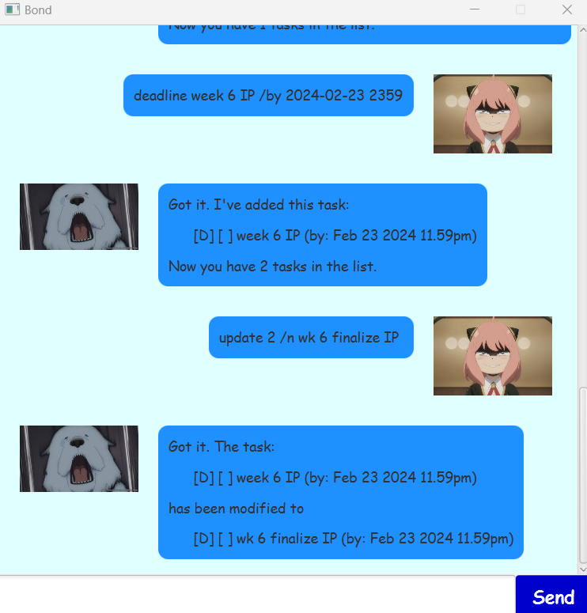

# Bond User Guide



Bond is a desktop app for managing personal tasks, optimized for use via a Command Line Interface (CLI) while still having the benefits of a Graphical User Interface (GUI). If you can type fast then Bond can help you keep track of your tasks much faster than traditional GUI apps.

## Notes about the command format:
- Words in UPPER_CASE are the parameters to be supplied by the user.
  e.g. in `todo TASKNAME`, `TASKNAME` is a parameter which can be used as `todo read book`.


- Items in square brackets are optional.
  e.g. `/n TASKNAME [/d DEADLINE]` can be used as `/n sleep /d 2024-02-29 10pm` or as `/n sleep`.


- Time can be in 24-hour format or 12-hour format. 
  * 24-hour format: `HHmm`
  * 12-hour format: `HH.[mm]am/pm`

## Adding todos `todo`

Adds a todo task to the task list managed by Bond.

Format: `todo TASKNAME`

Examples: 
* `todo read book`
* `todo buy groceries`
* `todo buy book`

Successfully adding a todo task will result in the following output:

```
Got it. I've added this task:
    [T][ ] read book
Now you have 1 task in the list.
```


## Adding deadlines `deadline`

Adds a deadline task to the task list managed by Bond.

Format: `deadline TASKNAME /by YYYY-MM-DD TIME`

Examples:
* `deadline submit assignment /by 2024-02-29 10.20pm`
* `deadline submit assignment /by 2024-02-29 2220`
* `deadline submit assignment /by 2024-02-29 10pm`

Successfully adding a deadline task will result in the following output:

```
Got it. I've added this task:
    [D][ ] submit assignment (by: 29 Feb 2024 10.20pm)
Now you have 1 tasks in the list.
```


## Adding events `event`

Adds an event task to the task list managed by Bond.

Format: `event TASKNAME /from YYYY-MM-DD TIME /to YYYY-MM-DD TIME`

Examples:
* `event exam /from 2024-03-03 1pm /to 2024-03-03 3pm`
* `event exam /from 2024-03-03 1300 /to 2024-03-03 1500`
* `event exam /from 2024-03-03 1pm /to 2024-03-03 1500`

Successfully adding an event task will result in the following output:

```
Got it. I've added this task:
    [E][ ] exam (from: 3 Mar 2024 1pm to: 3 Mar 2024 3pm)
Now you have 1 tasks in the list.
```

## Listing all tasks `list`

Lists all tasks in the task list managed by Bond.

Format: `list`

Examples:
* `list`

Successfully listing all tasks will result in the following output:

```
Here are the tasks in your list:
    1. [T][ ] read book
    2. [D][ ] submit assignment (by: 29 Feb 2024 10.20pm)
    3. [E][ ] exam (from: 3 Mar 2024 1pm to: 3 Mar 2024 3pm)
```

## Marking a task `mark`

Marks a task in the task list managed by Bond.

Format: `mark INDEX`

Examples:
* `mark 1`
* `mark 2`
* `mark 3`

Successfully marking a task will result in the following output:

```
Nice! I've marked this task as done:
    [T][X] read book
```

## Un-marking a task `unmark`

Marks a task in the task list managed by Bond.

Format: `unmark INDEX`

Examples:
* `unmark 1`
* `unmark 2`
* `unmark 3`

Successfully marking a task will result in the following output:

```
OK! I've marked this task as not done yet:
    [T][ ] read book
```

## Deleting a task `delete`

Deletes a task from the task list managed by Bond.

Format: `delete INDEX`

Examples:
* `delete 1`
* `delete 2`
* `delete 3`

Successfully deleting a task will result in the following output:

```
Got it. I've removed this task:
    [T][ ] read book
Now you have 2 tasks in the list.
```

## Finding a task `find`

Finds a task in the task list managed by Bond.

Format: `find KEYWORD [MORE_KEYWORDS]`

Examples:
* `find book`
* `find fantasy book`
* `find fantasy book fiction`

Successfully finding a task will result in the following output:

```
Here are the matching tasks in your list:
    1. [T][ ] read book
    2. [D][ ] buy book (by: 29 Feb 2024 10.20pm)
```

## Updating a task `update`

Updates a task in the task list managed by Bond.

Format: `update INDEX [ADDITIONAL DETAILS]`

Additional Details format:
* For a todo task: `/n TASKNAME`
* For a deadline task: `[/n TASKNAME] [/d YYYY-MM-DD TIME]`
* For an event task: `[/n TASKNAME] [/s YYYY-MM-DD TIME] [/e YYYY-MM-DD TIME]`

Critical Notes:
* At least one field is required for a deadline or event task otherwise an error will occur.
* Each field must be preceded by its corresponding flag (e.g. `/n` for task name, `/d` for deadline, `/s` for start datetime, `/e` for end datetime) and separated from its flag with a whitespace.
* The order of the fields does not matter. This is only true for the update method.
* If multiple fields of the same type are provided, only the first field will be used.

Examples:
* `update 1 /n read book`
* `update 2 /n buy book /d 2024-02-29 10.20pm`
* `update 3 /n exam /s 2024-03-03 1pm /e 2024-03-03 3pm`

Successfully updating a task will result in the following output:

```
Got it. The task:
    [E][ ] exam (from: 3 Mar 2024 1pm to: 3 Mar 2024 3pm)
has been modified to:
    [E][ ] 2103T exam (from: 3 Mar 2024 1pm to: 3 Mar 2024 4pm)
```

## Exiting the application `bye`

Exits the Bond task management application.

Format: `bye`

Examples:
* `bye`

Successfully exiting the application will result in the following output before the application closes:

```
Bye. Hope to see you again soon!
```
